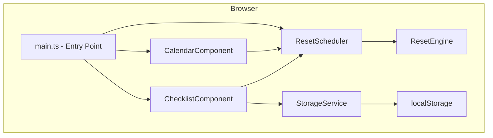

# Design Document: Game Checklist

## Overview

The Game Checklist is a client-side single-page application (SPA) that helps players track recurring in-game activities. It runs entirely in the browser with no backend — all state is persisted in `localStorage`. The UI consists of two primary panels: a **Calendar** at the top and a **Checklist** below it, grouped by reset period (daily, 3-day, weekly).

The application is built with **vanilla TypeScript** compiled by **Vite**, styled with **CSS custom properties** for theming, and tested with **Vitest** (unit/property tests) and **fast-check** (property-based testing). No UI framework is required given the limited scope, which keeps the bundle small and the architecture transparent.

### Key Design Decisions

- **No backend / no auth**: All data lives in `localStorage`. This is appropriate for a personal tracking tool and avoids infrastructure complexity.
- **Vanilla TypeScript over a framework**: The feature set is well-defined and small. A framework would add overhead without meaningful benefit.
- **Deterministic reset schedules**: Reset boundaries are computed from a fixed anchor date (configurable at build time), making them independently verifiable and testable without mocking the clock.
- **Separation of concerns**: Reset logic, storage, and UI rendering are kept in distinct modules so each can be tested independently.

---

## Architecture



### Module Responsibilities

| Module | Responsibility |
|---|---|
| `main.ts` | Bootstrap, wires components together, starts tick loop |
| `CalendarComponent` | Renders month grid, highlights today, shows reset indicators |
| `ChecklistComponent` | Renders grouped items, handles check/uncheck, shows timers & progress |
| `ResetScheduler` | Owns the 1-second tick loop; notifies components when resets fire |
| `ResetEngine` | Pure functions: compute next reset boundary, check if reset has elapsed |
| `StorageService` | Read/write `localStorage`; handles parse errors and schema validation |
| `types.ts` | Shared TypeScript interfaces and enums |
| `config.ts` | Build-time constants (anchor date, activity list) |

### Data Flow

1. On page load, `main.ts` calls `StorageService.load()` to retrieve saved state.
2. `ResetEngine` compares stored timestamps against `Date.now()` to determine which groups need resetting.
3. Components are initialized with the resolved state.
4. `ResetScheduler` starts a `setInterval` tick (1 second). On each tick it:
   - Updates timer displays in `ChecklistComponent`.
   - Checks if any reset boundary has been crossed; if so, triggers a reset and re-renders.
   - Checks if the calendar day has changed; if so, re-renders `CalendarComponent`.
5. User interactions (check/uncheck) flow through `ChecklistComponent` → `StorageService.save()`.

---

## Components and Interfaces

### CalendarComponent

Renders a month grid. Receives the current date and a list of upcoming reset dates.

```typescript
interface CalendarProps {
  today: Date;
  resetDates: ResetDateEntry[];
}

interface ResetDateEntry {
  date: Date;           // The date on which a reset occurs
  type: ResetType;      // 'daily' | 'three-day' | 'weekly'
  label: string;        // Display label, e.g. "Daily Reset"
}
```

**Responsibilities:**
- Render the current month grid with today highlighted.
- Show reset indicators on applicable dates.
- Support previous/next month navigation (purely presentational — does not change "today").
- Display a notice if `resetDates` is empty due to a load failure.

### ChecklistComponent

Renders the grouped activity list and owns the timer display.

```typescript
interface ChecklistProps {
  groups: ActivityGroup[];
  onToggle: (itemId: string, checked: boolean) => void;
}

interface ActivityGroup {
  resetPeriod: ResetPeriod;   // 'daily' | 'three-day' | 'weekly'
  label: string;              // e.g. "Daily Activities"
  items: ChecklistItem[];
  nextResetAt: number;        // Unix timestamp ms
}

interface ChecklistItem {
  id: string;
  name: string;
  activityType: ActivityType;
  completed: boolean;
}
```

**Responsibilities:**
- Render items in the required order: Daily_Instance → Daily_Quest → Three_Day_Instance → Weekly_Instance → Weekly_Quest.
- Show a `Reset_Timer` per group in the required format.
- Show a progress indicator per group (e.g., "3 / 5").
- Apply strikethrough + 50% opacity to completed items.
- Call `onToggle` on checkbox interaction.

### ResetEngine

A module of pure functions — no side effects, no I/O. This is the core of the testable logic.

```typescript
// Returns the next reset boundary timestamp (ms) after `now`
function nextDailyReset(now: number, timezoneOffsetMs: number): number;

function nextThreeDayReset(now: number, anchorDate: number): number;

function nextWeeklyReset(now: number): number; // Next Wednesday 00:00 UTC

// Returns true if a reset boundary has been crossed between `savedAt` and `now`
function hasDailyResetElapsed(savedAt: number, now: number, timezoneOffsetMs: number): boolean;

function hasThreeDayResetElapsed(savedAt: number, now: number, anchorDate: number): boolean;

function hasWeeklyResetElapsed(savedAt: number, now: number): boolean;

// Formats a duration in ms to HH:MM:SS
function formatCountdownHMS(durationMs: number): string;

// Formats a duration in ms to DD:HH:MM
function formatCountdownDHM(durationMs: number): string;
```

### StorageService

Wraps `localStorage` with schema validation and error handling.

```typescript
interface PersistedState {
  version: number;
  items: Record<string, ItemState>;
  nextResetBoundaries: {
    daily: number;       // Unix timestamp ms
    threeDay: number;
    weekly: number;
  };
}

interface ItemState {
  completed: boolean;
  lastChangedAt: number; // Unix timestamp ms
}

interface StorageService {
  load(): PersistedState | null;   // null = missing, corrupt, or schema mismatch
  save(state: PersistedState): SaveResult;
}

type SaveResult = { ok: true } | { ok: false; error: string };
```

### ResetScheduler

Owns the tick loop and fires callbacks.

```typescript
interface ResetScheduler {
  start(callbacks: SchedulerCallbacks): void;
  stop(): void;
}

interface SchedulerCallbacks {
  onTick: (now: number) => void;          // Every second
  onDailyReset: () => void;
  onThreeDayReset: () => void;
  onWeeklyReset: () => void;
  onDayChange: () => void;                // Calendar day changed
}
```

---

## Data Models

### Activity Configuration (`config.ts`)

Activities are defined statically at build time. The list is the source of truth for item IDs and names.

```typescript
export const ACTIVITIES: ActivityDefinition[] = [
  { id: 'daily-instance-1', name: 'Daily Instance A', type: 'Daily_Instance' },
  { id: 'daily-instance-2', name: 'Daily Instance B', type: 'Daily_Instance' },
  { id: 'daily-quest-1',    name: 'Daily Quest A',    type: 'Daily_Quest' },
  // ... more items
  { id: 'three-day-1',      name: '3-Day Instance A', type: 'Three_Day_Instance' },
  { id: 'weekly-instance-1',name: 'Weekly Instance A',type: 'Weekly_Instance' },
  { id: 'weekly-quest-1',   name: 'Weekly Quest A',   type: 'Weekly_Quest' },
];

// Fixed anchor date for 3-day reset schedule (configurable at build time)
export const THREE_DAY_ANCHOR_DATE: number = new Date('2024-01-01T00:00:00Z').getTime();
```

### Enums and Types

```typescript
export type ActivityType =
  | 'Daily_Instance'
  | 'Daily_Quest'
  | 'Three_Day_Instance'
  | 'Weekly_Instance'
  | 'Weekly_Quest';

export type ResetPeriod = 'daily' | 'three-day' | 'weekly';

export type ResetType = 'daily' | 'three-day' | 'weekly';

export interface ActivityDefinition {
  id: string;
  name: string;
  type: ActivityType;
}
```

### localStorage Schema

Key: `game-checklist-state`

```json
{
  "version": 1,
  "items": {
    "daily-instance-1": { "completed": true,  "lastChangedAt": 1700000000000 },
    "daily-quest-1":    { "completed": false, "lastChangedAt": 1700000000000 }
  },
  "nextResetBoundaries": {
    "daily":    1700010000000,
    "threeDay": 1700100000000,
    "weekly":   1700200000000
  }
}
```

**Schema validation rules:**
- `version` must equal `1` (current schema version).
- `items` must be a non-null object; each value must have `completed: boolean` and `lastChangedAt: number`.
- `nextResetBoundaries` must have all three keys as positive numbers.
- Any violation causes `StorageService.load()` to return `null` and logs a console warning.

---

## Correctness Properties

*A property is a characteristic or behavior that should hold true across all valid executions of a system — essentially, a formal statement about what the system should do. Properties serve as the bridge between human-readable specifications and machine-verifiable correctness guarantees.*

### Property 1: Reset boundary is always in the future

*For any* current timestamp `now`, `nextDailyReset(now)`, `nextThreeDayReset(now, anchor)`, and `nextWeeklyReset(now)` SHALL each return a value strictly greater than `now`.

**Validates: Requirements 4.3, 5.3, 6.3**

---

### Property 2: Reset elapsed detection is consistent with boundary computation

*For any* pair of timestamps `(savedAt, now)`, `hasDailyResetElapsed(savedAt, now)` SHALL return `true` if and only if `now >= nextDailyReset(savedAt)`. The same invariant holds for `hasThreeDayResetElapsed` and `hasWeeklyResetElapsed` with their respective boundary functions.

**Validates: Requirements 4.2, 5.2, 6.2, 7.2**

---

### Property 3: 3-day reset boundaries are exactly 72 hours apart

*For any* timestamp `t`, consecutive 3-day reset boundaries SHALL be exactly 72 hours (259,200,000 ms) apart. That is, `nextThreeDayReset(nextThreeDayReset(t, anchor), anchor) - nextThreeDayReset(t, anchor) === 259_200_000`.

**Validates: Requirements 5.1, 5.5**

---

### Property 4: Weekly reset always lands on Wednesday 00:00 UTC

*For any* timestamp `now`, `nextWeeklyReset(now)` SHALL return a timestamp whose UTC day-of-week is Wednesday (3) and whose UTC hours, minutes, and seconds are all zero.

**Validates: Requirements 6.1, 6.3**

---

### Property 5: HH:MM:SS timer format encodes duration correctly

*For any* duration in milliseconds `d` where `0 <= d < 360,000,000` (100 hours), `formatCountdownHMS(d)` SHALL return a string matching the pattern `HH:MM:SS` where the total seconds represented equals `Math.floor(d / 1000)`, the seconds component is in `[0, 59]`, and the minutes component is in `[0, 59]`.

**Validates: Requirements 2.5, 4.3**

---

### Property 6: DD:HH:MM timer format encodes duration correctly

*For any* duration in milliseconds `d` where `0 <= d < 8,640,000,000` (100 days), `formatCountdownDHM(d)` SHALL return a string matching the pattern `DD:HH:MM` where the total minutes represented equals `Math.floor(d / 60000)`, the minutes component is in `[0, 59]`, and the hours component is in `[0, 23]`.

**Validates: Requirements 5.3, 6.3**

---

### Property 7: Storage serialization round-trip

*For any* valid `PersistedState` object, serializing it via `StorageService.save()` and then deserializing it via `StorageService.load()` SHALL produce a value deeply equal to the original, including all item completion states, timestamps, and next reset boundary values.

**Validates: Requirements 7.1, 7.4**

---

### Property 8: Invalid storage always returns null

*For any* string that is not valid JSON, or any JSON value that does not conform to the `PersistedState` schema (wrong `version`, missing required fields, wrong field types, or negative timestamps), `StorageService.load()` SHALL return `null` without throwing.

**Validates: Requirements 7.3**

---

### Property 9: Reset clears exactly the correct activity group

*For any* checklist state containing items across all activity types, triggering a reset for a given `ResetPeriod` SHALL set `completed = false` for all items belonging to that period's activity types, and SHALL leave all items belonging to other periods unchanged.

- Daily reset: clears `Daily_Instance` and `Daily_Quest` only.
- 3-day reset: clears `Three_Day_Instance` only.
- Weekly reset: clears `Weekly_Instance` and `Weekly_Quest` only.

**Validates: Requirements 4.1, 5.1, 6.1**

---

### Property 10: Progress indicator matches actual completion state

*For any* `ActivityGroup` with `n` total items where `k` items have `completed = true`, the rendered progress string SHALL equal `"${k} / ${n}"`. This must hold immediately after any check or uncheck action, for all values of `k` in `[0, n]`.

**Validates: Requirements 3.5**

---

### Property 11: Check/uncheck round-trip restores original state

*For any* `ChecklistItem`, checking it (setting `completed = true`) and then unchecking it (setting `completed = false`) SHALL result in the item having `completed = false` with no strikethrough or reduced-opacity styles applied — identical to its initial unchecked state.

**Validates: Requirements 3.1, 3.2**

---

### Property 12: Calendar reset indicators match the reset schedule exactly

*For any* displayed month and any list of `ResetDateEntry` objects, the calendar SHALL render a visible indicator for every date in the list that falls within the displayed month, and SHALL render no indicator for any date not in the list. No indicators shall be added or omitted.

**Validates: Requirements 1.3, 1.5, 5.6, 6.5**

---

## Error Handling

| Scenario | Behavior |
|---|---|
| `localStorage` write fails (quota exceeded, private mode) | `StorageService.save()` returns `{ ok: false, error }`. `ChecklistComponent` displays a non-blocking toast/banner warning. Does not throw. |
| `localStorage` data missing or corrupt | `StorageService.load()` returns `null`. All items initialize to unchecked. Console warning logged. |
| `localStorage` schema version mismatch | Treated as corrupt — returns `null`, initializes fresh. |
| Reset schedule data unavailable (future: if fetched remotely) | Calendar renders without reset indicators; shows a notice to the player. |
| `Date` / timezone API unavailable | Graceful degradation: timers show `--:--:--`; reset logic falls back to UTC. |

---

## Testing Strategy

### Unit Tests (Vitest)

Unit tests cover specific examples, edge cases, and integration points between modules.

- `ResetEngine`: boundary cases (exactly at reset time, 1ms before, 1ms after), timezone edge cases for daily reset, anchor date edge cases for 3-day reset.
- `StorageService`: valid schema loads correctly, each type of schema violation returns `null`, save failure is surfaced correctly.
- `CalendarComponent`: correct month grid generation, today highlighting, reset indicator placement.
- `ChecklistComponent`: correct grouping order, progress indicator updates, timer format display.

### Property-Based Tests (Vitest + fast-check)

Property-based tests use **fast-check** to generate random inputs and verify universal properties. Each test runs a minimum of **100 iterations**.

Each test is tagged with a comment in the format:
`// Feature: game-checklist, Property N: <property text>`

**Properties to implement:**

| Test | Property | fast-check Arbitraries |
|---|---|---|
| PBT-1 | Reset boundary always in the future | `fc.integer({ min: 0, max: 2**53 - 1 })` for `now` |
| PBT-2 | Reset elapsed detection consistent with boundary | `fc.tuple(fc.integer({ min: 0 }), fc.integer({ min: 0 }))` for `(savedAt, now)` |
| PBT-3 | 3-day boundaries are exactly 72 hours apart | `fc.integer({ min: 0, max: 2**53 - 1 })` for `t` |
| PBT-4 | Weekly reset lands on Wednesday 00:00 UTC | `fc.integer({ min: 0, max: 2**53 - 1 })` for `now` |
| PBT-5 | HH:MM:SS format encodes duration correctly | `fc.integer({ min: 0, max: 359_999_999 })` for duration ms |
| PBT-6 | DD:HH:MM format encodes duration correctly | `fc.integer({ min: 0, max: 8_639_999_999 })` for duration ms |
| PBT-7 | Storage serialization round-trip | Custom `fc.record(...)` for `PersistedState` |
| PBT-8 | Invalid storage returns null | `fc.oneof(fc.string(), fc.anything())` for invalid payloads |
| PBT-9 | Reset clears exactly the correct activity group | `fc.record(...)` for checklist state + `fc.constantFrom('daily','three-day','weekly')` |
| PBT-10 | Progress indicator matches completion state | `fc.array(fc.boolean())` for item completion states |
| PBT-11 | Check/uncheck round-trip restores state | `fc.boolean()` for initial `completed` flag |
| PBT-12 | Calendar indicators match reset schedule exactly | `fc.array(fc.record({ date: fc.date(), type: fc.constantFrom(...) }))` for reset dates |

### Integration / Smoke Tests

- Verify the full page renders without JS errors on load.
- Verify that checking an item and reloading the page restores the checked state.
- Verify that simulating a crossed reset boundary (by manipulating stored timestamps) causes items to appear unchecked on reload.

### Accessibility

- Lighthouse CI run in the build pipeline targeting a score ≥ 90.
- Manual keyboard navigation check for checkbox interactions.
- Color contrast verified with automated tooling (axe-core) as part of the test suite.
